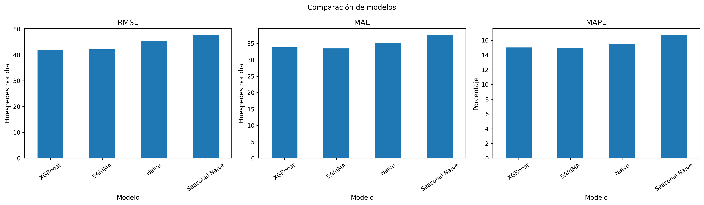
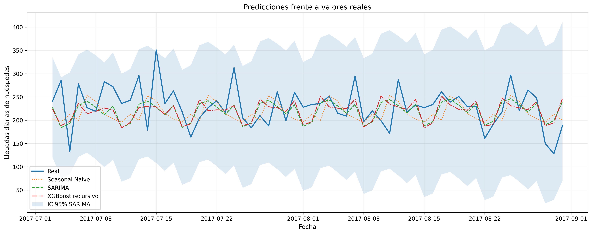

[README_SeriesTemporales_COMPLETO.md](https://github.com/user-attachments/files/30207916/README_SeriesTemporales_COMPLETO.md)
# Forecasting de llegadas diarias de huéspedes

Proyecto final de la materia **Series Temporales**, orientado a predecir el volumen diario de huéspedes asociados a reservas hoteleras no canceladas.

> **Alcance de la variable objetivo:** el proyecto modela **llegadas diarias de huéspedes** como indicador de demanda hotelera. No estima el porcentaje de ocupación ni las habitaciones ocupadas durante toda la estadía.

**Integrantes:** Macarena Rios y Andrea Cristaldo  
**Área de aplicación:** Turismo y demanda hotelera

---

## 1. Descripción del problema

Anticipar el volumen diario de llegadas permite apoyar decisiones relacionadas con:

- planificación de personal;
- preparación operativa y logística;
- gestión de inventario;
- asignación de recursos;
- estrategias de precios y capacidad.

El objetivo del proyecto es construir y evaluar un sistema de *forecasting* que pronostique la cantidad de huéspedes que llegan cada día, utilizando datos históricos de reservas hoteleras.

El flujo desarrollado comprende:

1. adquisición y auditoría del dataset;
2. limpieza y construcción de la serie temporal;
3. análisis exploratorio;
4. evaluación de tendencia, estacionalidad y estacionariedad;
5. división cronológica de entrenamiento y prueba;
6. modelos de referencia;
7. modelo estadístico SARIMA;
8. modelo de *machine learning* XGBoost;
9. comparación mediante métricas de error;
10. análisis de residuales;
11. exportación de datos, resultados y visualizaciones.

---

## 2. Dataset

- **Nombre:** Hotel Booking Demand
- **Fuente:** [Kaggle — Hotel Booking Demand](https://www.kaggle.com/datasets/jessemostipak/hotel-booking-demand)
- **Unidad original:** reserva hotelera
- **Período:** 2015–2017
- **Registros originales:** 119.390
- **Reservas no canceladas válidas:** 75.011
- **Período de la serie:** 1 de julio de 2015 al 31 de agosto de 2017
- **Frecuencia:** diaria
- **Observaciones temporales:** 793
- **Variable objetivo:** `llegadas`

La serie diaria se construye sumando, para cada reserva válida:

```text
total_huespedes = adults + children + babies
```

Posteriormente, los huéspedes se agregan por fecha de llegada.

El archivo procesado se guarda en:

```text
data/datos.csv
```

### Estadísticos principales de la serie

| Indicador | Valor |
|---|---:|
| Observaciones | 793 |
| Media diaria | 184,12 |
| Mediana diaria | 188 |
| Desviación estándar | 69,23 |
| Mínimo diario | 24 |
| Máximo diario | 526 |
| Días con cero llegadas | 0 |

---

## 3. Preprocesamiento y construcción de la serie

El preprocesamiento incluye:

1. reconstrucción de `arrival_date` a partir de año, mes y día;
2. conversión segura de las variables numéricas;
3. imputación con cero de los cuatro valores faltantes en `children`;
4. cálculo del total de huéspedes por reserva;
5. exclusión de reservas canceladas;
6. exclusión de 180 registros sin huéspedes;
7. exclusión de fechas inválidas, si existieran;
8. agregación diaria de huéspedes;
9. regularización de la frecuencia diaria;
10. verificación de continuidad temporal.

La serie obtenida no presentó fechas faltantes dentro de su intervalo, por lo que no fue necesario incorporar días artificiales con valor cero.

### Auditoría de calidad

La auditoría revisa:

- tipos de datos;
- valores faltantes;
- valores únicos;
- tasa de cancelación;
- fechas inválidas;
- reservas sin huéspedes;
- duplicados exactos.

La tasa de cancelación del dataset original es de **37,04 %**.

---

## 4. Análisis de duplicados

Se detectaron:

- **31.994 duplicados adicionales**;
- equivalentes al **26,80 %** del dataset original;
- 87.396 filas únicas al conservar la primera aparición.

El dataset no contiene un identificador único de reserva que permita distinguir con certeza entre:

- errores de duplicación;
- reservas diferentes con atributos idénticos;
- reservas repetidas legítimas.

Por este motivo, los duplicados no se eliminaron automáticamente de la serie oficial.

Como análisis de sensibilidad se construyó una segunda serie eliminando las repeticiones exactas:

| Indicador | Serie oficial | Serie sin duplicados |
|---|---:|---:|
| Total de huéspedes | 146.007 | 125.235 |
| Media diaria | 184,12 | 157,93 |
| Desviación estándar | 69,23 | 56,52 |
| Máximo diario | 526 | 326 |

Resultados de sensibilidad:

- reducción del total y de la media diaria: **14,23 %**;
- correlación de Pearson: **0,9065**;
- correlación de Spearman: **0,9047**.

La serie sin duplicados se utiliza exclusivamente como análisis complementario. Los modelos y métricas oficiales se calculan con la serie original.

---

## 5. Análisis exploratorio de la serie

El análisis exploratorio incluye:

- serie temporal original;
- distribución y diagrama de caja;
- detección de días extremos mediante IQR;
- patrones por día de la semana;
- patrones mensuales;
- medias móviles de 7 y 30 días;
- desviación estándar móvil;
- descomposición STL;
- resumen anual;
- matriz año–mes;
- estabilidad del patrón semanal por año;
- análisis de sensibilidad ante duplicados.

### Patrones encontrados

- **Viernes** presenta el promedio diario más alto: aproximadamente 205,57 huéspedes.
- **Sábado** también registra una demanda elevada: aproximadamente 200,52.
- **Martes** presenta el promedio más bajo: aproximadamente 153,41.
- Los mayores promedios mensuales aparecen en **abril y mayo**.
- Los valores más bajos se observan principalmente en **enero, noviembre y diciembre**.
- La descomposición STL confirma una estructura estacional semanal relevante.
- El promedio anual aumenta desde 141,00 en 2015 hasta 202,47 en 2017, considerando que 2015 y 2017 son años parciales dentro del dataset.

Se identificaron cuatro días por encima del límite superior del criterio IQR. Estos valores no se eliminaron automáticamente porque pueden representar picos reales de demanda.

---

## 6. Estacionariedad

Se aplicaron las pruebas:

- Augmented Dickey-Fuller (ADF);
- Kwiatkowski-Phillips-Schmidt-Shin (KPSS).

| Serie | ADF p-valor | KPSS p-valor | Interpretación |
|---|---:|---:|---|
| Original | 0,09194 | 0,01000 | No estacionaria |
| Primera diferencia | 0,00000 | 0,10000 | Estacionaria |

Los resultados, junto con la ACF, PACF y la estacionalidad semanal, sustentan el uso de diferenciación regular y estacional en SARIMA.

---

## 7. División temporal

La evaluación se realiza sobre el último bloque de la serie:

| Conjunto | Observaciones | Período |
|---|---:|---|
| Entrenamiento | 733 | 2015-07-01 a 2017-07-02 |
| Prueba | 60 | 2017-07-03 a 2017-08-31 |

No se utiliza mezcla aleatoria. El orden cronológico se conserva para evitar fuga de información.

El conjunto de prueba se mantiene completamente separado de la selección de modelos e hiperparámetros.

---

## 8. Modelos implementados

Se comparan cuatro estrategias.

### 8.1 Naive

Repite el último valor disponible del conjunto de entrenamiento para todas las fechas del horizonte de prueba.

### 8.2 Seasonal Naive

Repite el patrón observado durante los últimos siete días del entrenamiento.

### 8.3 SARIMA

Modelo estadístico seleccionado mediante una búsqueda de órdenes utilizando exclusivamente el conjunto de entrenamiento.

Configuración final:

```text
order = (0, 1, 1)
seasonal_order = (1, 1, 1, 7)
AIC = 7788,334
```

La periodicidad estacional de siete días corresponde al patrón semanal observado en el EDA.

### 8.4 XGBoost recursivo

El modelo utiliza 13 variables predictoras:

- componentes cíclicos del día de la semana;
- componentes cíclicos del mes;
- componentes cíclicos del día del año;
- rezagos de 1, 7, 14 y 28 días;
- medias móviles de 7 y 14 días;
- desviación móvil de 7 días.

Los hiperparámetros se seleccionan mediante `TimeSeriesSplit`.

Configuración final:

```text
learning_rate = 0.03
max_depth = 3
n_estimators = 200
subsample = 0.8
```

El MAE medio obtenido durante la validación temporal fue de **42,5457**.

La predicción final se realiza de forma recursiva: cada pronóstico se incorpora al historial usado para construir los rezagos de la fecha siguiente. De esta manera no se utilizan valores reales futuros del conjunto de prueba.

La variable más importante para XGBoost fue la media móvil de siete días, seguida por los rezagos de siete y un día.

---

## 9. Métricas de evaluación

Se utilizan las métricas obligatorias:

- **RMSE:** penaliza con mayor intensidad los errores grandes;
- **MAE:** error absoluto medio expresado en huéspedes por día;
- **MAPE:** error porcentual medio, excluyendo valores reales iguales a cero.

También se incluyen:

- **sMAPE:** error porcentual simétrico;
- **MASE:** comparación respecto de un pronóstico estacional ingenuo;
- **R²:** proporción de variabilidad explicada en el test.

---

## 10. Resultados

| Modelo | RMSE | MAE | MAPE | sMAPE | MASE | R² |
|---|---:|---:|---:|---:|---:|---:|
| **XGBoost** | **41,8795** | 33,8183 | 15,0265 % | 15,0752 % | 0,6601 | 0,0390 |
| **SARIMA** | 42,1173 | **33,4811** | **14,9293 %** | **14,9573 %** | **0,6535** | 0,0281 |
| Naive | 45,4410 | 35,0833 | 15,4631 % | 15,5932 % | 0,6848 | -0,1314 |
| Seasonal Naive | 47,8276 | 37,6833 | 16,7552 % | 16,8046 % | 0,7356 | -0,2533 |

### Interpretación

- **XGBoost** obtiene el menor RMSE.
- **SARIMA** obtiene los mejores valores de MAE, MAPE, sMAPE y MASE.
- Ambos modelos principales superan a los baselines.
- XGBoost reduce el RMSE del Seasonal Naive en aproximadamente **12,44 %**.
- La diferencia entre SARIMA y XGBoost es pequeña, por lo que no existe un ganador dominante en todas las métricas.
- Los valores bajos de R² indican que permanece una proporción importante de variabilidad diaria sin explicar.





---

## 11. Análisis de residuales

Para SARIMA y XGBoost se analizan:

- evolución temporal de los residuales;
- distribución;
- gráfico Q-Q;
- autocorrelación;
- prueba de Ljung–Box.

Resultados de Ljung–Box:

| Modelo | Rezago | p-valor | Interpretación |
|---|---:|---:|---|
| SARIMA | 7 | 0,44461 | Sin evidencia de autocorrelación residual |
| SARIMA | 14 | 0,10917 | Sin evidencia de autocorrelación residual |
| XGBoost | 7 | 0,76316 | Sin evidencia de autocorrelación residual |
| XGBoost | 14 | 0,30163 | Sin evidencia de autocorrelación residual |

En los rezagos analizados no se rechaza la hipótesis nula de ausencia de autocorrelación residual. Sin embargo, los gráficos muestran colas asociadas a días de demanda extrema, por lo que los errores no deben interpretarse como perfectamente normales.

---

## 12. Conclusiones

1. SARIMA y XGBoost superan a los modelos Naive y Seasonal Naive.
2. XGBoost presenta el menor RMSE, mientras que SARIMA logra mejores MAE y métricas porcentuales.
3. La estacionalidad semanal es uno de los componentes más relevantes de la serie.
4. Los rezagos y medias móviles aportan información predictiva importante para XGBoost.
5. Los modelos capturan buena parte de la dependencia temporal evaluada, ya que no se observa autocorrelación residual significativa en los rezagos 7 y 14.
6. Los picos diarios siguen siendo difíciles de predecir.
7. La decisión sobre duplicados afecta la escala de la serie, aunque la estructura temporal general conserva una correlación alta.
8. Las llegadas diarias son un indicador de demanda, pero no representan directamente la ocupación nocturna del establecimiento.

---

## 13. Limitaciones

- La variable objetivo representa llegadas, no habitaciones ocupadas ni porcentaje de ocupación.
- No existe un identificador único que permita clasificar todos los duplicados como errores o reservas legítimas.
- El dataset contiene principalmente información interna de reservas.
- No se incorporan feriados, eventos, clima, promociones ni precios externos.
- El período 2015–2017 puede no representar las condiciones turísticas actuales.
- La evaluación utiliza un único bloque final de 60 días.
- Los modelos explican una proporción limitada de la variabilidad diaria.
- Los resultados corresponden al dataset completo y no necesariamente a un hotel individual.

---

## 14. Trabajo futuro

- incorporar feriados, eventos, clima, precios y promociones;
- evaluar modelos SARIMAX con variables exógenas;
- realizar validación *walk-forward* con varios orígenes temporales;
- evaluar intervalos de predicción y calibración probabilística;
- analizar por separado los dos tipos de hotel;
- evaluar modelos como Prophet, LightGBM o redes recurrentes;
- profundizar el análisis de duplicados mediante un identificador de reserva;
- estudiar otros horizontes de predicción.

---

## 15. Visualizaciones y resultados generados

La notebook crea automáticamente archivos en `results/`, entre ellos:

### Análisis exploratorio

- `serie_original.png`
- `distribucion_y_atipicos.png`
- `patrones_calendario.png`
- `medias_moviles.png`
- `variabilidad_movil.png`
- `descomposicion_stl.png`
- `acf_pacf.png`
- `heatmap_anio_mes.png`
- `heatmap_patron_semanal_anual.png`

### Duplicados y sensibilidad

- `resumen_duplicados_exactos.csv`
- `duplicados_por_mes.csv`
- `distribucion_temporal_duplicados.png`
- `comparacion_series_duplicados.csv`
- `indicadores_sensibilidad_duplicados.csv`
- `sensibilidad_duplicados_series.png`
- `conclusion_sensibilidad_duplicados.txt`

### Modelado y evaluación

- `division_train_test.png`
- `seleccion_sarima.csv`
- `seleccion_xgboost.csv`
- `importancia_variables_xgboost.png`
- `metricas.csv`
- `predicciones.csv`
- `predicciones_vs_reales.png`
- `comparacion_modelos.png`
- `residuales_sarima.png`
- `residuales_xgboost.png`
- `diagnostico_ljungbox.csv`
- `configuracion_modelos.json`

---

## 16. Estructura del repositorio

```text
series-temporales-ocupacion-hotelera/
│
├── ST_TPF_Rios_Cristaldo_Revisión.ipynb
│
├── data/
│   ├── hotel_bookings.csv
│   └── datos.csv
│
├── results/
│   ├── metricas.csv
│   ├── predicciones.csv
│   ├── serie_original.png
│   ├── predicciones_vs_reales.png
│   ├── comparacion_modelos.png
│   ├── residuales_sarima.png
│   ├── residuales_xgboost.png
│   └── ...
│
├── README.md
└── requirements.txt
```

---

## 17. Reproducción

### Google Colab

1. Abrir `ST_TPF_Rios_Cristaldo_Revisión.ipynb`.
2. Ejecutar las celdas en orden.
3. La notebook crea automáticamente las carpetas `data/` y `results/`.
4. Si el CSV original no existe, se descarga mediante `kagglehub`.
5. Las métricas, predicciones y figuras se exportan automáticamente.

Las celdas de autenticación y publicación en GitHub son opcionales y no forman parte del pipeline analítico.

### Ejecución local

Clonar el repositorio:

```bash
git clone https://github.com/screamingvalkirias-png/series-temporales-ocupacion-hotelera.git
cd series-temporales-ocupacion-hotelera
```

Crear un entorno virtual e instalar dependencias:

```bash
python -m venv .venv
```

En Windows:

```bash
.venv\Scripts\activate
```

En Linux/macOS:

```bash
source .venv/bin/activate
```

Instalar dependencias:

```bash
pip install -r requirements.txt
```

Abrir la notebook:

```bash
jupyter notebook ST_TPF_Rios_Cristaldo_Revisión.ipynb
```

---

## 18. Dependencias principales

```text
pandas
numpy
matplotlib
scipy
statsmodels
scikit-learn
xgboost
kagglehub
```

---

## 19. Autoras

- **Macarena Rios**
- **Andrea Cristaldo**
